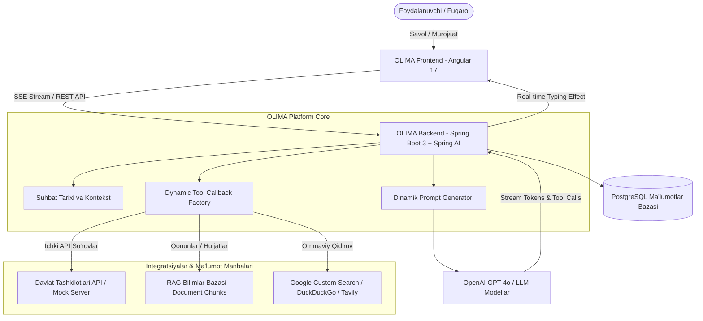

# 🏛️ OLIMA — Universal AI Agent Platform for Ministries & Organizations

<p align="center">
  
  
  
  
  
  
</p>

---

## 📌 Loyiha haqida (About The Project)

**OLIMA** — Vazirliklarga va turli davlat hamda xususiy tashkilotlarga tushadigan murojaatlarga avtomatik va intellektual tarzda javob beruvchi universal AI Agent platformasi.

Ushbu platforma faqat bitta vazirlik (masalan, Oliy ta'lim vazirligi) bilan cheklanib qolmay, **Zero-Code Dynamic Integration** arxitekturasi asosida qurilgan. Ya'ni har qanday yangi vazirlik (Transport, Soliq, Sog'liqni saqlash) yoki kompaniyani **kodga bitta ham o'zgartirish kiritmasdan**, Admin Panel orqali 1 daqiqada platformaga ulash, uning ichki API vositalarini (Tools) ro'yxatdan o'tkazish va AI agentini darhol ishga tushirish imkoniyatini taqdim etadi.

---

## ✨ Asosiy Imkoniyatlar (Key Features)

### 1. 🏢 Universal & Dynamic Multi-Tenant Arxitektura
* **Kod yozmasdan integratsiya:** Admin Panel orqali yangi tashkilot va uning API'lari (GET, POST, parametrlar) kiritiladi.
* **Avtomatik Tool Callback Generatsiyasi:** Spring AI yordamida har bir tashkilotning vositalari real vaqt rejimida OpenAI JSON-Schema formatiga o'girilib, agentga dinamik ulanadi.

### 2. ⚡ Real-Time SSE Token Streaming & Typing Cursor
* **Server-Sent Events (SSE):** Tokenlar modeldan kelishi bilan real vaqtda birma-bir ekranga uzatiladi.
* **Visual Tool Execution:** Agent qaysi ichki tool yoki qidiruv tizimini ishlatganini, bajarilish vaqtini (ms) va natijasini dialogda interaktiv ko'rsatadi.

### 3. 🛡️ Shaxsiy Ma'lumotlar Daxlsizligi (Privacy Guard)
* Fuqarolarning shaxsiy ma'lumotlari (Talaba GPA balari, kontrakt summasi, stipendiya to'lovlari, ariza va shikoyatlar) **hech qachon ochiq internetga chiqarilmaydi**.
* Ushbu ma'lumotlar faqat tashkilotning himoyalangan ichki tizimlari (`get_student_profile`, `get_student_contract`, ...) orqali olinadi.

### 4. 🌐 Ko'p qatlamli Internet Qidiruvi (Multi-Engine Web Fallback)
Tashkilotga oid umumiy va ommaviy savollar ichki bazada topilmasa, agent avtomatik ravishda tashqi internetdan qidiradi:
* **Google Programmable Custom Search Engine (CSE):** Rasmiy Google qidiruv integratsiyasi.
* **DuckDuckGo HTML Live Web Search:** O'zbek va xalqaro tillarda bepul, kalitsiz jonli qidiruv.
* **Tavily AI Search & SerpAPI:** AI-agentlar uchun ixtisoslashgan qidiruv quvvati.
* **Wikipedia API:** Ensiklopedik ma'lumotlar uchun qo'shimcha zaxira.
* Barcha javoblar rasmiy manba havolalari (URL citations) bilan taqdim etiladi.

### 5. 🧠 Suhbat Tarixi va Kontekstni Eslab Qolish (Context Awareness)
* Suhbatdagi oldingi savol-javoblar bazadan o'qilib, modelga uzatiladi.
* *"Kim bilan uchrashishim kerak bu uchun?"*, *"Qayerga boraman?"* kabi davomiy savollarni oldingi mavzuga bog'lab, to'liq mantiqiy javob beradi.

### 6. ⚠️ Begona Mavzularni Qat'iy Rad Etish (Domain Boundary)
* Vazirlikka aloqador bo'lmagan mavzularda (dasturlash kodlari, retseptlar, sport, o'yinlar) agent o'zini umumiy ChatGPT kabi tutmaydi, balki tashkilot obro'sini saqlagan holda rasmiy rad javobini beradi.

### 7. 🤝 Human-in-the-loop (Inson Tasdig'i)
* Mas'uliyatli harakatlar (masalan, vazirlikka rasmiy shikoyat/ariza qoldirish) avtomatik yuborilmaydi — avval qoralama (draft) yaratilib, foydalanuvchining tasdig'i olingandan so'ng topshiriladi.

---

## 🏗️ Arxitektura (System Architecture)



---

## 📁 Loyiha Strukturasi (Project Structure)

```
chat-bot/
├── olima-backend/             # Spring Boot 3.3.x & Spring AI Server
│   ├── src/main/java/com/olima/
│   │   ├── agent/             # AI Agent xizmati, SSE Streaming, Prompts
│   │   ├── organization/      # Multi-tenant tashkilotlarni boshqarish
│   │   ├── tool/              # Dinamik toollar, parametrlar, DynamicToolCallbackFactory
│   │   ├── execution/         # RestApi, RAG, WebSearchService (Google/DDG/Tavily)
│   │   ├── conversation/      # Suhbatlar va xabarlar tarixi
│   │   ├── knowledge/         # RAG hujjatlari va bo'laklari (Chunks)
│   │   ├── complaint/         # Tasdiqlash talab etiladigan arizalar
│   │   └── common/            # Xatolar qayta ishlovchisi, xavfsizlik, modellar
│   └── src/main/resources/    # application.yml, Liquibase migratsiyalar
├── olima-frontend/            # Angular 17+ Single Page Application
│   ├── src/app/
│   │   ├── pages/             # Chat, Dashboard, Organizations, Tools, Conversations
│   │   ├── services/          # SSE Stream reader, ApiService
│   │   └── models/            # TypeScript interfeyslar va DTOlar
├── mock-government/           # Davlat tashkilotlari test API'lari (Universitetlar, Talabalar)
├── docker-compose.yml         # 1-klikda barcha xizmatlarni konteynerlash
├── init-db.sql                # PostgreSQL boshlang'ich sxemasi
└── README.md                  # Hujjatlashtirish
```

---

## 🚀 O'rnatish va Ishga Tushirish (Getting Started)

### Talablar (Prerequisites):
* **Java 21+** (Oracle / Eclipse Temurin / Corretto)
* **Node.js 18+ & npm**
* **Docker & Docker Compose** (yoki mahalliy PostgreSQL 16)
* **OpenAI API Key**

---

### 1-Usul: Docker Compose Orqali (Eng Oson)

Loyihani to'liq (Backend + Frontend + Mock Server + PostgreSQL) bitta buyruq bilan ko'tarish:

```bash
docker-compose up -d --build
```

Xizmatlar portlari:
* **Frontend UI:** `http://localhost:4200`
* **Backend API:** `http://localhost:8080`
* **Mock Government API:** `http://localhost:8081`
* **PostgreSQL:** `localhost:5432`

---

### 2-Usul: Qo'lda Ishga Tushirish (Manual Run)

#### 1. Ma'lumotlar bazasini sozlash:
PostgreSQL'da `olima` nomli baza oching va `init-db.sql` skriptini bajaring.

#### 2. Backend'ni ishga tushirish:
```bash
cd olima-backend
# Muhit o'zgaruvchilarini berish (ixtiyoriy, default qiymatlar application.yml da mavjud)
export OPENAI_API_KEY="sizning-openai-api-kalitingiz"

mvn clean spring-boot:run
```

#### 3. Frontend'ni ishga tushirish:
```bash
cd olima-frontend
npm install
npm run start
```
Brauzerda oching: `http://localhost:4200`

---

## ⚙️ Sozlamalar (`application.yml`)

Qidiruv tizimlari va AI parametrlarini `application.yml` yoki muhit o'zgaruvchilari orqali boshqarish mumkin:

```yaml
spring:
  ai:
    openai:
      api-key: ${OPENAI_API_KEY}
      chat:
        options:
          model: gpt-4o-mini
          temperature: 0.3

search:
  google:
    api-key: ${GOOGLE_SEARCH_API_KEY}
    cx: ${GOOGLE_SEARCH_CX:b737d17f5512749a9}
  tavily:
    api-key: ${TAVILY_API_KEY}
  serpapi:
    api-key: ${SERPAPI_API_KEY}
```

---

## 🧪 Sinov Misollari (Testing Scenarios)

1. **Oliy ta'lim rasmiy qoidalari (Ichki Tool):**
   * *Savol:* `"O'qishni ko'chirish tartibi qanday?"`
   * *Natija:* Agent `get_transfer_rules` toolini chaqirib, rasmiy transfer muddatlari (15-iyul - 5-avgust) va GPA talablarini chiqaradi.
2. **Talabaning shaxsiy ma'lumotlari (Xavfsiz Tool):**
   * *Savol:* `"Mening stipendiyam qancha?"`
   * *Natija:* Agent Student ID so'raydi. ID kiritilgach (`ST1001`), ichki bazadan talaba stipendiyasini topib beradi (internetga chiqmaydi).
3. **Universitetlar va umumiy ommaviy savollar (Web Search Fallback):**
   * *Savol:* `"TATU haqida ma'lumot ber"` yoki `"Oliy ta'lim vazirligi vaziri kim?"`
   * *Natija:* Agent `search_universities` yoki Google/DuckDuckGo qidiruvidan foydalanib, rasmiy manba havolalari bilan javob beradi.
4. **Davomiy savollar (Kontekst xotirasi):**
   * *1-savol:* `"Men o'qishni muzlatib armiyaga borsam bo'ladimi?"`
   * *2-savol:* `"Kim bilan uchrashishim kerak bu uchun?"`
   * *Natija:* Agent oldingi savolni eslab, dekanat va kerakli harbiy hujjatlar bo'yicha to'liq yo'l ko'rsatadi.
5. **Begona mavzular (Xavfsiz rad javobi):**
   * *Savol:* `"PHP dasturlash tili haqida aytib ber"`
   * *Natija:* Agent vazirlikka tegishli bo'lmagan mavzuni darhol va xushmuomalalik bilan rad etadi.

---

## 👥 Mualliflar va Litsenziya

* **Loyiha:** OLIMA — Universal AI Agent Platform
* **Litsenziya:** MIT License
* 48 soatlik hakaton doirasida Oliy ta'lim va boshqa barcha davlat hamda xususiy tashkilotlar uchun ishlab chiqildi.
