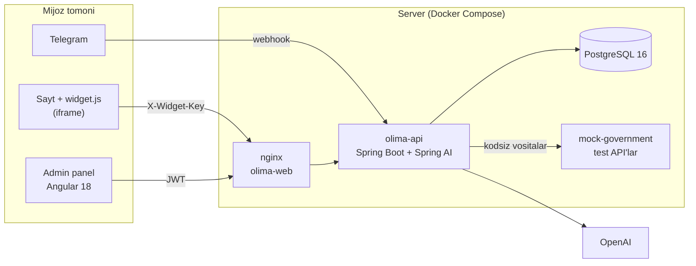

<div align="center">

# OLIMA AI

**Ta'lim muassasalari uchun o'z hujjatlariga tayanib, manbasi bilan javob beradigan AI yordamchi**

*Taxmin emas — bilim.*

[](https://oliytalim.178-105-158-192.sslip.io/)
[](https://olima.178-105-158-192.sslip.io/)
[](https://olima.178-105-158-192.sslip.io/demo/)
[](presentation/OLIMA-AI-Pitch-Deck.pdf)


**TadbirkorAI** jamoasi · National AI Hackathon, Xorazm · 17–20 sentabr 2026

</div>

---

> **EN:** OLIMA AI is a multi-tenant AI assistant for educational institutions in Uzbekistan. It answers students' and applicants' questions from the institution's own documents with citations, connects to internal systems without code, and never submits complaints without the user's confirmation. One line of code embeds it on any website.

## Muammo

Ta'lim muassasalari har kuni bir xil savollarga qo'lda javob beradi: *kontrakt qancha, qabul qachon, o'qishni qanday ko'chiraman, akademik ta'til qanday olinadi*. Javoblar telefon va Telegram orqali, navbat bilan, har safar har xil beriladi. Oddiy chatbot esa javobni **o'ylab topadi** — ta'lim sohasida bu xato qaror va shikoyatga olib keladi.

## Yechim

OLIMA AI — tashkilot saytiga bitta qator kod bilan qo'yiladigan yordamchi:

- **O'z hujjatlariga tayanadi.** Tashkilot nizom, qaror va yo'riqnomalarni yuklaydi; javob shu hujjatlardan olinadi va **manbasi ko'rsatiladi**.
- **Tizimlarga kodsiz ulanadi.** Kontrakt, stipendiya, talaba ma'lumoti kabi API'lar admin paneldan «vosita» sifatida qo'shiladi — dasturchi kerak emas.
- **Mas'uliyatli amalni o'zi qilmaydi.** Shikoyat va ariza avval qoralama bo'ladi; foydalanuvchi tasdiqlamaguncha hech narsa yuborilmaydi.
- **Har tashkilot alohida.** Ma'lumotlar, suhbatlar va sozlamalar tashkilot bo'yicha ajratilgan; tashkilot admini faqat o'zinikini ko'radi.

| Kim | Rol |
|---|---|
| **Foydalanuvchi** | talaba, abituriyent — savol beradi |
| **Mijoz (to'lovchi)** | ta'lim muassasasi — oylik obuna |
| **Birinchi segment** | Xorazmdagi xususiy o'quv markazlari, keyin OTMlar |

---

## Jonli demo

| Nima | Manzil |
|---|---|
| **Demo mijoz sayti** — widget ulangan namunaviy portal | https://oliytalim.178-105-158-192.sslip.io/ |
| **Admin panel** | https://olima.178-105-158-192.sslip.io/ |
| **Landing** | https://olima.178-105-158-192.sslip.io/demo/ |

> Admin panelga kirish ma'lumotlari tashkilotchilarga alohida beriladi.

**Taqdimot (Pitch Day):** [PDF](presentation/OLIMA-AI-Pitch-Deck.pdf) · [PowerPoint](presentation/OLIMA-AI-Pitch-Deck.pptx) — muammo, yechim, bozor, biznes model, jamoa.

**Demo'da nimani ko'rish mumkin:**
1. Demo saytni oching — bir necha soniyadan keyin logo ustida salomlashish kartasi chiqadi, logo atrofida impuls yonadi.
2. «Oliy ta'lim vazirligining ishonch telefoni qanday?» deb so'rang — javob manba bilan keladi.
3. «Shikoyat qoldirmoqchiman» deb yozing — bot qoralama tayyorlaydi va **tasdiqlashni so'raydi**.
4. Admin panelda: *Suhbatlar* — kim nima so'radi; *Bilimlar bazasi* — hujjat yuklash; *Vositalar* — API'ni kodsiz ulash; *Widget sozlamalari* — salomlashish matni; *Tashkilotlar → Ulanish ma'lumotlari* — SDK qatori va kirish hisobi.

---

## Imkoniyatlar

| Imkoniyat | Tavsif |
|---|---|
| **Bilimlar bazasi** | PDF, DOCX, DOC, TXT, RTF, HTML (25 MB gacha) yoki veb-sahifa manzili. Matn avtomatik ajratiladi va bo'laklanadi |
| **Manbali javob** | Javob qaysi hujjatdan olingani ko'rsatiladi |
| **Kodsiz vositalar** | API manzili, metod va parametrlar paneldan kiritiladi; ish vaqtida agentga vosita bo'lib ulanadi |
| **Tasdiqlash oqimi** | Shikoyat/ariza — qoralama → foydalanuvchi tasdig'i → yuborish |
| **Widget (SDK)** | Bitta `<script>` qatori; iframe ichida ishlaydi — mijoz saytining CSS va ma'lumotlariga tegmaydi |
| **Widget kaliti** | Tashkilot kalit orqali **server tomonda** aniqlanadi; brauzerdan kelgan tashkilot ID'siga ishonilmaydi |
| **Salomlashish kartasi** | Matni tashkilot admini tomonidan panelda boshqariladi |
| **Telegram bot** | Tashkilot o'z botini ulaydi — yordamchi Telegram'da ham javob beradi |
| **Real vaqt oqimi** | Javob SSE orqali so'zma-so'z chiqadi; chaqirilgan vositalar va vaqti ko'rinadi |
| **Rollar** | Super admin — hamma tashkilotlar; tashkilot admini — faqat o'z tashkiloti |
| **Suhbat konteksti** | Davomiy savollar oldingi xabarlarga bog'lab tushuniladi |
| **Mavzu chegarasi** | Tashkilotga aloqasi yo'q savollar (dasturlash, retsept va h.k.) muloyim rad etiladi |

### Saytga ulash

Admin panel → *Tashkilotlar* → **Ulanish ma'lumotlari** oynasida tayyor qator va kirish hisobi beriladi (nusxa olish yoki fayl bo'lib yuklab olish):

```html
<script src="https://olima.178-105-158-192.sslip.io/widget.js"
        data-key="wk_…"
        async></script>
```

Ixtiyoriy atributlar: `data-title`, `data-accent`, `data-theme`, `data-greeting`, `data-suggest`. Sayt o'z tugmalaridan ham chaqira oladi: `OlimaAI.open()`, `OlimaAI.ask("savol")`.

---

## Arxitektura



**Agent qanday javob beradi:** savol → tashkilotning bilimlar bazasidan qidiruv va kerak bo'lsa vositalar chaqiruvi (masalan, talaba kontrakti) → model faqat topilgan ma'lumot asosida javob yozadi → javob manba bilan qaytadi. Mas'uliyatli vosita (`create_complaint_draft`) faqat qoralama yaratadi.

### Loyiha tuzilishi

```
chat-bot/
├── olima-backend/        Spring Boot API: agent, bilimlar bazasi, vositalar, auth, Telegram
│   └── src/main/java/com/olima/
│       ├── agent/          suhbat, SSE oqim, tizim ko'rsatmalari
│       ├── knowledge/      hujjat yuklash, matn ajratish (Apache Tika), bo'laklash, qidiruv
│       ├── tool/ execution/ kodsiz vositalar va ularni chaqirish
│       ├── complaint/      qoralama → tasdiqlash oqimi
│       ├── organization/   tashkilotlar, widget kaliti va sozlamalari
│       ├── security/ auth/ JWT, widget kaliti filtri, tashkilot chegarasi
│       └── telegram/       tashkilot botlari, webhook
├── olima-frontend/       Admin panel (Angular 18 + Material)
├── widget/               widget.js (SDK), chat oynasi, landing
├── portal/               demo mijoz sayti
├── mock-government/      test API'lar (talaba, kontrakt, stipendiya, OTM)
└── deploy/               prod: Docker Compose, nginx, auto-deploy (deploy/README.md)
```

---

## Ishga tushirish

### Docker bilan (tavsiya)

```bash
git clone https://github.com/AsadbekRajabboyevv/chat-bot.git
cd chat-bot
echo "OPENAI_API_KEY=sk-..." > .env
docker compose up -d --build
```

| Servis | Manzil |
|---|---|
| Admin panel | http://localhost:4200 |
| API | http://localhost:8080/api/v1 |
| Test API (mock-government) | http://localhost:8081 |

### Docker'siz

Talablar: **Java 21** (JDK 23+ da Lombok ishlamaydi, `-Dmaven.compiler.proc=full` kerak), Node.js 20, PostgreSQL 16.

```bash
# backend
./mvnw -pl olima-backend -am package -DskipTests
DB_HOST=localhost DB_PORT=5432 DB_USERNAME=olima DB_PASSWORD=olima DB_NAME=olima \
OPENAI_API_KEY=sk-... java -jar olima-backend/target/olima-backend-0.0.1-SNAPSHOT.jar

# panel
cd olima-frontend && npm ci && npm start     # http://localhost:4200
```

Windows uchun tayyor skript: `ishga-tushir.ps1` / `to-xtat.ps1`.

### Asosiy sozlamalar

| O'zgaruvchi | Vazifasi |
|---|---|
| `OPENAI_API_KEY` | model kaliti (majburiy) |
| `OPENAI_MODEL` | sukut bo'yicha `gpt-4o-mini` |
| `DB_HOST`, `DB_PORT`, `DB_NAME`, `DB_USERNAME`, `DB_PASSWORD` | PostgreSQL |
| `JWT_SECRET`, `SUPER_ADMIN_USERNAME`, `SUPER_ADMIN_PASSWORD` | admin kirishi (prod'da albatta o'zgartiring) |
| `CORS_ORIGINS` | panelga ruxsat etilgan manzillar |
| `TAVILY_API_KEY`, `GOOGLE_SEARCH_API_KEY`, `GOOGLE_SEARCH_CX` | internet qidiruvi (ixtiyoriy) |

---

## Sinov ssenariylari

Test ma'lumotlari `mock-government` servisida — **soxta, faqat demo uchun**. Talaba ID'lari: `STU-001` … `STU-005`.

| Savol | Kutiladigan xatti-harakat |
|---|---|
| «O'qishni boshqa OTMga ko'chirish tartibi qanday?» | `get_transfer_rules` vositasi chaqiriladi |
| «Kontrakt qarzim qancha?» → `STU-001` | ID so'raladi, `get_student_contract` orqali javob |
| «Akademik ta'til qanday olinadi?» | bilimlar bazasi / `get_academic_leave_rules` |
| «Dekanat ustidan shikoyat qilmoqchiman» | qoralama yaratiladi, **tasdiqlash so'raladi** |
| «PHP haqida aytib ber» | mavzudan tashqari — muloyim rad |

---

## Deploy

Repo'da ikki asosiy branch: **`dev`** — ish, **`prod`** — serverdagi versiya. `prod` ga push qilinganda server bir daqiqa ichida o'zgarishni sezadi, manbadan yig'adi, ishga tushiradi va tekshiradi; tekshiruvdan o'tmasa oldingi versiyaga o'zi qaytadi. Batafsil: [`deploy/README.md`](deploy/README.md).

---

## Keyingi qadamlar

| Bosqich | Nima |
|---|---|
| **Yaqin** | o'zbekcha qidiruv (qo'shimchalar, lotin/kirill), moslik chegarasi — «manba yo'q, javob yo'q» kodda majburiy, javobda moslik foizi |
| **1–2 oy** | ma'no bo'yicha (semantik) qidiruv, qonunlarni modda/band bo'yicha bo'laklash, doimiy sifat o'lchovi |
| **Pilot** | operatorga uzatish, «javob topilmagan savollar» hisoboti, HEMIS OAuth orqali talabaning shaxsiy ma'lumotlari, mahalliy serverda joylashtirish |

---

## Jamoa — TadbirkorAI

Xorazm. To'rt kishi: mahsulot, backend, web va dizayn.

| A'zo | Rol | Mas'uliyat |
|---|---|---|
| **Mukhammadsolayev Akbar** | Loyiha rahbari | Arxitektura, mahsulot, qidiruv va iqtibos |
| **Rajabboyev Asadbek** | Backend | Server, AI agent, Telegram bot |
| **Meyliboyev Meyliboy** | Web | Admin panel, assistent oynasi, demo sayt |
| **Bobonazarov Jasurbek** | Dizayn / UI-UX | Foydalanuvchi oqimi, interfeys |
